# 5.2 SERVICIO DE DIRECTORIO DE LINUX

1. Dominios
2. LDAP
3. Instalar y configurar
4. Añadir cliente en OpenLDAP
5. Dominios Samba
6. Configurar Samba
7. Comprobar dominio Samba

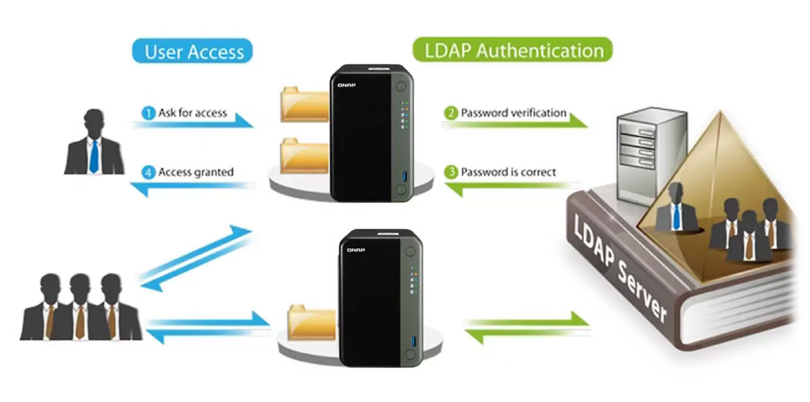

# DOMINIOS

Un dominio suele asociarse directamente a un controlador de dominio, (Active Directory de Windows) a políticas centralizadas y a una gestión unificada de usuarios y equipos. En Linux, sin embargo, el concepto de dominio existe, pero se articula de una forma más modular, más flexible y, en muchos casos, más transparente.

Un dominio, en términos generales, no es más que un conjunto de sistemas, usuarios y recursos que comparten una infraestructura común de autenticación, autorización y, normalmente, resolución de nombres. En Linux no existe una única “pieza” que lo haga todo, sino que el dominio se construye combinando servicios: DNS, **LDAP**, Kerberos, servicios de archivos, políticas de acceso y mecanismos de integración entre sistemas.

Resumiendo, en Linux no se “instala un dominio”, sino que se diseña y se construye, obligando a entender qué hace cada servicio, cómo se comunica con los demás y qué papel juega dentro de la arquitectura global.


En un sistema local, los usuarios están definidos en /etc/passwd, las contraseñas (o hashes) en /etc/shadow, los grupos en /etc/group, y los permisos se gestionan directamente en el sistema de archivos. Este modelo funciona perfectamente para un número muy reducido de máquinas, pero se vuelve ineficiente y difícil de mantener en cuanto el número de sistemas crece.

Crear usuarios manualmente en cada máquina, mantener contraseñas sincronizadas, asegurar que los permisos son coherentes y revocar accesos cuando un usuario deja la organización se convierte rápidamente en una tarea poco realista. Aquí es donde aparece la necesidad de un dominio. Este permite centralizar la información de usuarios y grupos, de modo que las máquinas cliente no almacenan esa información localmente, sino que la consultan a un servicio central. Esto implica que un usuario puede iniciar sesión en diferentes equipos con las mismas credenciales, que los cambios se aplican de forma inmediata y que la administración se simplifica enormemente.


El DNS es la base sobre la que se apoyan prácticamente todos los servicios de red. Cuando hablamos de un dominio como sistemas.local, estamos definiendo un ámbito dentro del cual los nombres de máquinas, servicios y recursos tienen significado. En un entorno de dominio Linux, el DNS no solo sirve para traducir nombres a direcciones IP, sino también para localizar servicios, especialmente cuando se utilizan tecnologías como LDAP o Kerberos.

Un dominio necesita un DNS coherente y bien configurado. Cuando un cliente Linux quiere autenticarse contra un servidor LDAP, necesita saber dónde está ese servidor. Puede configurarse manualmente, pero lo habitual y lo profesional es que lo descubra mediante DNS. Los servicios no viven aislados, sino que se apoyan unos en otros.

Crear un dominio Linux implica:

- ☐ Definir un nombre de dominio coherente, tanto a nivel DNS como a nivel organizativo. Este nombre será el identificador lógico del dominio y aparecerá en múltiples configuraciones.
- ☐ Configurar un servidor DNS que gestione ese dominio y resuelva correctamente los nombres de los sistemas implicados.
- ☐ Instalar y configurar un servicio de directorio, normalmente LDAP, que almacenará la información de usuarios, grupos y, en algunos casos, equipos.
- ☐ Configurar los sistemas cliente para que utilicen ese servicio de directorio en lugar de (o además de) los ficheros locales para la autenticación.

# LDAP

LDAP (Lightweight Directory Access Protocol), protocolo de acceso a servicios de directorio. Un servicio de directorio es una estructura jerárquica diseñada para almacenar información que se consulta mucho y se modifica poco, como usuarios, grupos, equipos, políticas o servicios.

LDAP actúa como el corazón del sistema de autenticación centralizada. En lugar de que cada máquina tenga su propia lista de usuarios, todas consultan al servidor LDAP cuando necesitan autenticar a alguien y este puede almacenar cualquier tipo de información estructurada: direcciones de correo, certificados, claves públicas, información organizativa, etc. Sin embargo, en el ámbito de sistemas, su uso principal es la gestión centralizada de identidades.


LDAP Arquitectura

Con **arquitectura** LDAP, nos referimos a cómo se organizan los distintos componentes, la arquitectura en Linux es **modular**, lo que significa que cada servicio cumple una función concreta y puede ser sustituido, escalado o reforzado de forma independiente. Esta modularidad es una de las grandes fortalezas del ecosistema Linux en entornos profesionales.

☐ El núcleo lo constituye el **servidor de directorio** LDAP, que actúa como repositorio central de identidades. Este servidor no autentica por sí mismo en el sentido tradicional, sino que almacena la información necesaria para que otros sistemas puedan hacerlo: usuarios, grupos, identificadores numéricos, shells, rutas de directorios personales y atributos organizativos.

☐ El DNS juega un papel estructural, ya que permite localizar los servicios del dominio de forma dinámica y coherente. En arquitecturas bien diseñadas, los clientes no se configuran con direcciones IP “a mano”, sino que descubren los servicios mediante nombres de dominio.

**LDAP Arquitectura**

En los sistemas cliente, la arquitectura se completa con componentes de capas de autenticación y de integración entre el sistema operativo y el dominio como NSS y PAM.

La idea consiste en disponer de un servidor que facilite la autenticación de los clientes, de modo que éstos recurran al servidor cada vez que un usuario necesite identificarse. De esta forma, la cuenta de usuario no es específica de un equipo cliente, sino que será válida en cualquier equipo de la red que haya sido debidamente configurado.

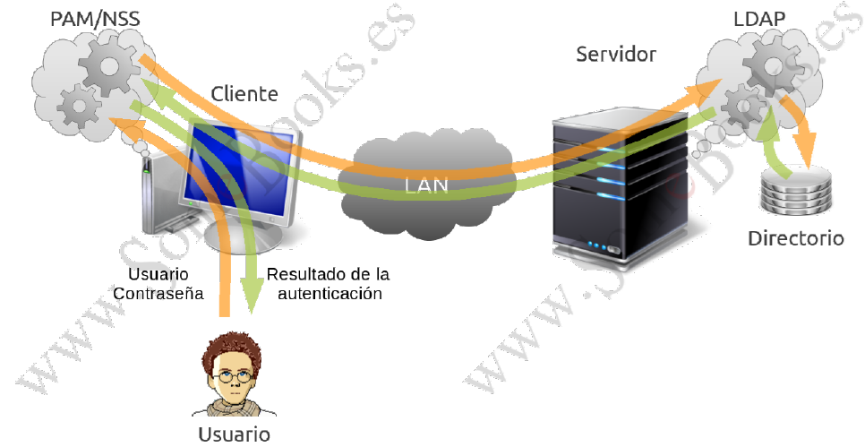


NSS (Name Service Switch) mecanismo que utiliza Linux para localizar información de usuarios y grupos. Permite al sistema saber si un usuario existe y obtener sus datos (UID, GID, directorio personal, etc.), consultando distintas fuentes como archivos locales o un servidor LDAP. En un entorno con LDAP, NSS se encarga de “preguntar” al directorio por los usuarios en lugar de buscarlos solo en el sistema local.

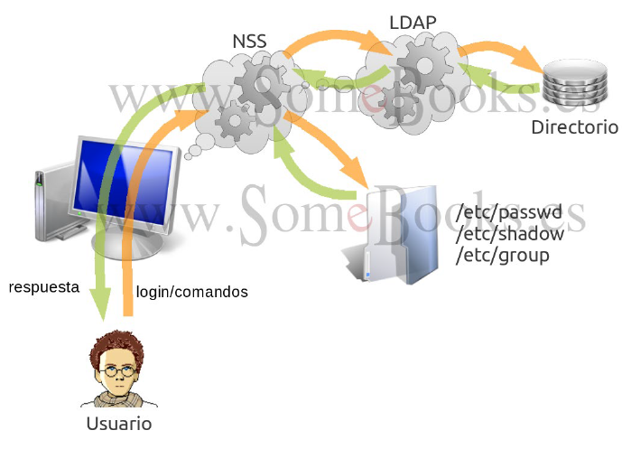

PAM (Pluggable Authentication Modules) es el responsable de la autenticación. Su función es comprobar si el usuario puede iniciar sesión, validando la contraseña y aplicando las políticas de seguridad configuradas. Cuando se usa LDAP, PAM consulta al directorio para verificar las credenciales y decidir si se permite o no el acceso al sistema.

Es el método que utilizan la mayoría de las aplicaciones y herramientas de Linux que necesitan relacionarse, de algún modo, con la autenticación de los usuarios.

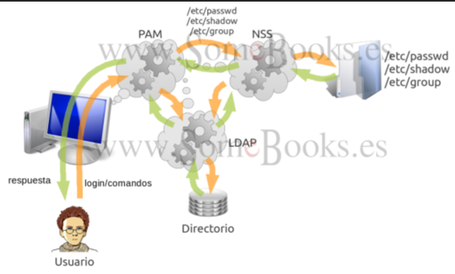


Una de las ventajas que aporta LDAP cuando lo combinamos con NFS es que podemos guardar el perfil de una cuenta de usuario en el servidor NFS. De este modo, cuando un usuario se autentica en cualquier equipo de la red usando su cuenta LDAP, podrá acceder de forma automática a una carpeta compartida donde se guardan los perfiles de las cuentas. (Perfiles móviles de usuario)

A continuación, se muestran los pasos a seguir


1. Crear una carpeta en el servidor para guardar la carpeta /home de los usuarios móviles (el equivalente a /home/usuario de cada usuario, pero en el servidor).
2. Modificar el archivo /etc/exports para compartir el directorio anterior con permisos de lectura/escritura para todos los usuarios.
3. Modificar las cuentas de usuario LDAP para indicar que la carpeta donde deben tener su perfil se encuentra dentro de la carpeta que crearemos en el siguiente paso.
4. Crear una carpeta en los equipos cliente para montar los perfiles móviles (el equivalente a /home/usuario de cada usuario en cada cliente).
5. Modificar el archivo /etc/fstab de cada cliente para que monte la carpeta que hemos creado en el paso 1 en el punto de montaje establecido en el paso 4 y reiniciar el equipo.


**CARACTERÍSTICAS**

☐ Centralización. Todos los usuarios y grupos se gestionan desde un único punto, lo que reduce errores, simplifica tareas y mejora la trazabilidad. Cualquier cambio en el directorio se refleja inmediatamente en todos los sistemas integrados, sin necesidad de intervención manual en cada equipo.

☐ Escalabilidad es posible añadir réplicas del servidor LDAP, balancear carga, segmentar el directorio por unidades organizativas y adaptar el sistema a nuevas necesidades sin interrumpir el servicio.

☐ Interoperabilidad estándar ampliamente soportado, lo que permite que sistemas muy distintos puedan integrarse en el mismo dominio.

☐ Seguridad, permite aplicar controles de acceso precisos y coherentes. La autenticación centralizada facilita la revocación inmediata de permisos, algo crítico cuando un usuario deja de pertenecer a la organización.

☐ Coherencia de identidad. Cada usuario tiene un único identificador dentro del dominio, lo que evita problemas habituales como duplicidades de UID o inconsistencias en permisos.

**USOS**

☐ Gestión centralizada de usuarios en entornos Linux. En aulas, centros educativos o empresas con múltiples equipos, un dominio LDAP permite que el alumnado o el personal utilice las mismas credenciales en cualquier máquina, manteniendo su entorno de trabajo y sus permisos.

☐ Integración de servicios. Servidores web, servicios de bases de datos, plataformas de aprendizaje, sistemas de control de versiones o aplicaciones corporativas pueden delegar la autenticación en LDAP.

☐ En entornos educativos, para unificar el acceso a recursos, como servidores de archivos, escritorios remotos o plataformas virtuales.

☐ En el ámbito empresarial, como base para infraestructuras híbridas, donde conviven distintos sistemas y tecnologías. LDAP actúa como nexo común, permitiendo que la identidad del usuario sea reconocida y validada en todos los servicios de la organización.


**Versiones de LDAP**

☐ LDAPv1: Fue la primera versión del protocolo, pero resultó ser poco práctica debido a limitaciones y falta de características clave. No se utilizó ampliamente en la implementación.

☐ LDAPv2: Esta versión mejoró algunas deficiencias de la versión anterior, pero aún tenía limitaciones significativas en términos de seguridad y capacidades.

☐ LDAPv3: Esta es la versión más ampliamente adoptada y utilizada de LDAP. Introdujo numerosas mejoras y características nuevas, incluyendo:

- Mecanismos de autenticación y seguridad mejorados, como TLS/SSL para cifrado de datos.
- Soporte para búsquedas más flexibles y eficientes.
- Capacidad para manejar datos binarios y Unicode.
- Soporte para extensiones, lo que permitió a los desarrolladores agregar funcionalidad adicional al protocolo.
- Esquema mejorado para describir los tipos de datos y atributos.

**LDAP estructura**

LDAP utiliza una estructura jerárquica en forma de árbol, conocida como DIT (Directory Information Tree).

☐ En la parte superior del árbol se encuentra la raíz del directorio, que suele corresponder al dominio. Por ejemplo, para el dominio asir.local, la base del directorio podría ser dc=asir, dc=local. A partir de ahí, se crean ramas que organizan la información de forma lógica.

☐ Normalmente, se crean ramas para usuarios, grupos, equipos y otros objetos. Cada entrada del directorio tiene un nombre distinguido o DN, que indica su posición exacta dentro del árbol. Este DN es fundamental para localizar y gestionar los objetos.

Este modelo jerárquico encaja muy bien con la idea de dominio, ya que refleja la estructura organizativa de una empresa o centro educativo. Además, permite aplicar políticas y permisos de forma granular.

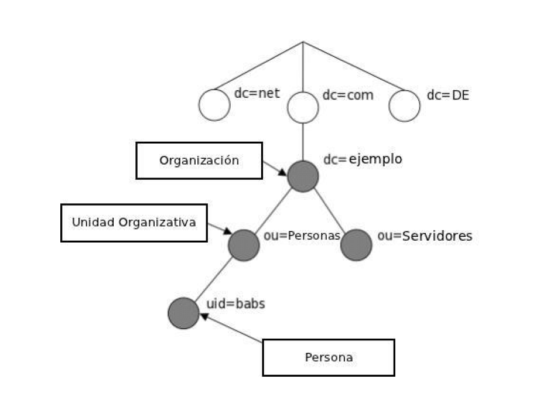

**LDAP Identificadores**

☐ DC (Domain Component) representa una parte del nombre de dominio. Cada DC corresponde a un nivel del dominio DNS. Por ejemplo, en dc=asir,dc=local, asir y local son componentes del dominio. Los DC suelen utilizarse para definir la base del directorio y su correspondencia con el dominio de red.

☐ DN (Distinguished Name) es el identificador único y completo de un objeto dentro del directorio LDAP. Podría compararse con una ruta absoluta en un sistema de archivos. El DN indica exactamente dónde se encuentra un objeto dentro del DIT. Por ejemplo, un usuario podría tener un DN como cn=juan,ou=usuarios,dc=asir,dc=local. Este DN no solo identifica al usuario, sino también su posición jerárquica dentro del directorio.

☐ CN (Common Name) es el nombre común del objeto dentro de su contexto. En el caso de usuarios, suele ser el nombre del usuario; en el caso de grupos, el nombre del grupo; y en otros objetos, un identificador descriptivo. El CN no tiene por qué ser único en todo el directorio, pero sí debe ser único dentro de su rama inmediata.

☐ Atributos son las propiedades que describen a un objeto dentro del directorio LDAP. Un objeto, por sí solo, no es más que una entrada dentro del DIT; son los atributos los que le dan significado. Por ejemplo, un usuario tendrá atributos como nombre, identificador numérico, grupo principal, shell por defecto o directorio personal.

- Están definidos por los esquemas LDAP, que establecen qué atributos son obligatorios y cuáles son opcionales para cada tipo de objeto. Por ejemplo, un usuario de tipo posixAccount debe tener un UID y un GID, mientras que otros atributos pueden ser opcionales.
- Están asociados directamente al objeto dentro del DIT. No existen de forma independiente.


LDIF (LDAP Data Interchange Format) es un formato de archivo de texto utilizado para representar y transferir datos en sistemas que utilizan el protocolo LDAP.

Estos archivos contienen instrucciones para crear, modificar o eliminar entradas en un directorio. Cada instrucción está escrita en forma de texto plano y sigue una estructura predefinida. Un archivo LDIF puede contener varias instrucciones que describen acciones como agregar nuevos objetos, modificar atributos existentes o eliminar entradas.

Su importancia radica en que permite trabajar con LDAP de forma reproducible y automatizable, algo esencial en entornos profesionales. Gracias a LDIF, es posible versionar cambios, reutilizar configuraciones y aplicar modificaciones de forma controlada.

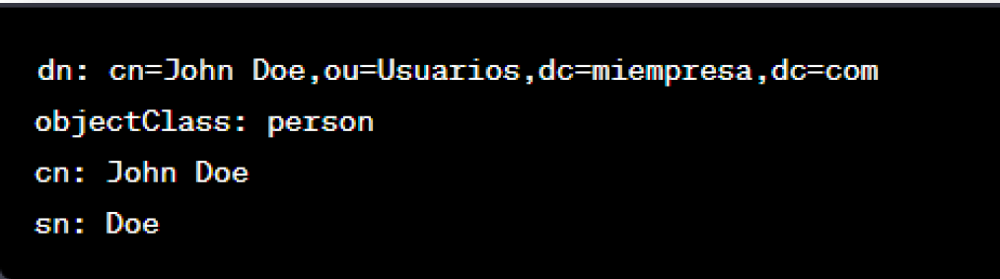

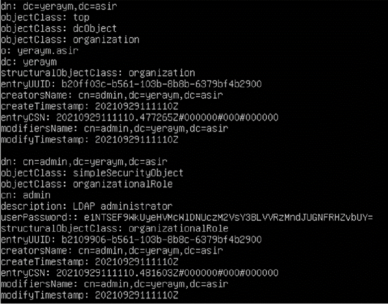


LDAP es un protocolo, es decir, un conjunto de normas que define cómo se accede a un servicio de directorio, no es un software que se instale. OpenLDAP, en cambio, es una implementación concreta de ese protocolo.

Nadie “instala HTTP”; se instalan servidores web como Apache o Nginx que usan el protocolo HTTP. Con LDAP ocurre exactamente lo mismo. Por tanto, no existe eso de “tener LDAP instalado”. Lo que existe es tener un software que implemente el protocolo LDAP. Cuando alguien dice “tengo LDAP instalado”, en realidad lo que tiene instalado es:

☐ Un servidor LDAP, normalmente OpenLDAP (implementación concreta de ese protocolo)
☐ Y/o clientes LDAP (herramientas que hablan el protocolo LDAP)

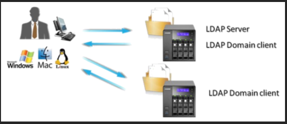

# OPENLDAP

OpenLDAP es un software de código abierto y multiplataforma que implementa el protocolo LDAP, diseñado para crear y gestionar servicios de directorio. Técnicamente, incluye varios componentes, entre los que destacan:

- ☐ slapd (Stand-alone LDAP Daemon): el demonio o servidor LDAP que escucha peticiones de clientes LDAP y responde según el protocolo.
- ☐ Bibliotecas LDAP: implementaciones de las rutinas necesarias para que aplicaciones y herramientas puedan comunicarse con el servidor.
- ☐ Herramientas cliente: utilidades como ldapsearch, ldapadd, ldapmodify, etc., que permiten consultar y modificar el directorio LDAP desde la línea de comandos mediante archivos ldif.

https://www.openldap.org/


# LDAP

|  Comando | Descripción  |
| --- | --- |
|  ldapadd | Agrega un objeto al directorio LDAP.  |
|  ldapmodify | Modifica un objeto en el directorio LDAP. El protocolo permite tres modificaciones diferentes, añadir nuevo valor, reemplazar valor o eliminar valor.  |
|  ldapdelete | Elimina un objeto del directorio LDAP.  |
|  ldapsearch | Busca objetos en el directorio LDAP.  |
|  ldapcompare | Compara los atributos de dos objetos en el directorio LDAP.  |
|  ldapbind | Se conecta a un servidor LDAP.  |
|  ldapunbind | Se desconecta de un servidor LDAP.  |
|  ldappasswd | Cambia la contraseña de un usuario.  |
|  ldapurl | Convierte una URL LDAP en un nombre de objeto LDAP.  |
|  ldapschema | Obtiene el esquema de un servidor LDAP.  |

# INSTALAR Y CONFIGURAR

Instalaremos los siguientes paquetes:

- slapd: Representa el servidor LDAP en el proyecto OpenLDAP.
- ldap-utils: Contiene herramientas de línea de comandos que te permiten interactuar con servidores LDAP, realizar búsquedas, administrar entradas, entre otras operaciones.
  
```
:~# apt install slapd ldap-utils
```

dpkg-reconfigure slapd: Cuando ejecutas este comando en la terminal, se abrirá un asistente interactivo que te guiará a través de la configuración del servidor LDAP. Este te hará una serie de preguntas relacionadas con la configuración del servidor, como el nombre del dominio, la contraseña de administrador, el tipo de backend de base de datos (por ejemplo, HDB o BDB), entre otros aspectos.


```
:~# dpkg-reconfigure slapd
```

El archivo de configuración /etc/ldap/ldap.conf permite definir parámetros globales para las interacciones LDAP en el sistema.

☐ BASE: La base de búsqueda predeterminada para las consultas LDAP. (dc)
☐ URI: La URL del servidor LDAP al que se conectará el sistema.

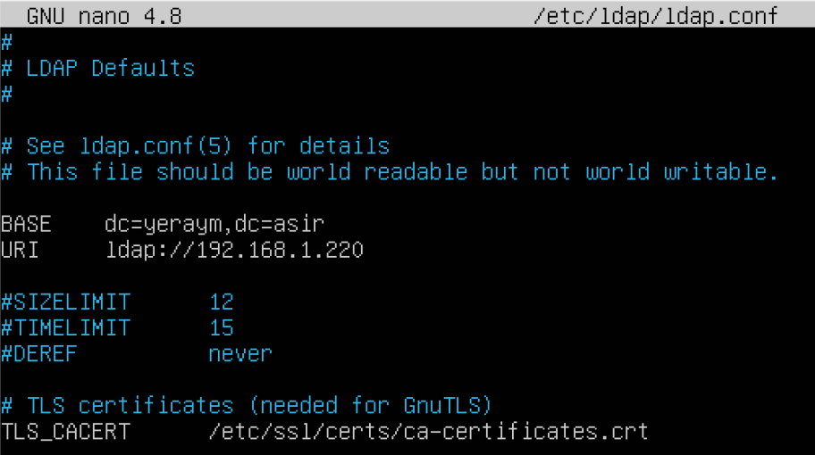


El comando slapcat es una herramienta de línea de comandos utilizada en sistemas con OpenLDAP para exportar contenido de la base de datos del servidor LDAP en formato LDIF. Opciones:

☐ -l archivo: Redirige la salida a un archivo en lugar de mostrarla en la consola.

☐ -f archivo: Utiliza un archivo de configuración alternativo.

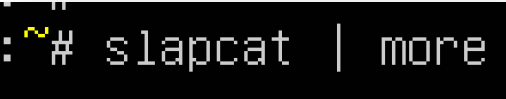

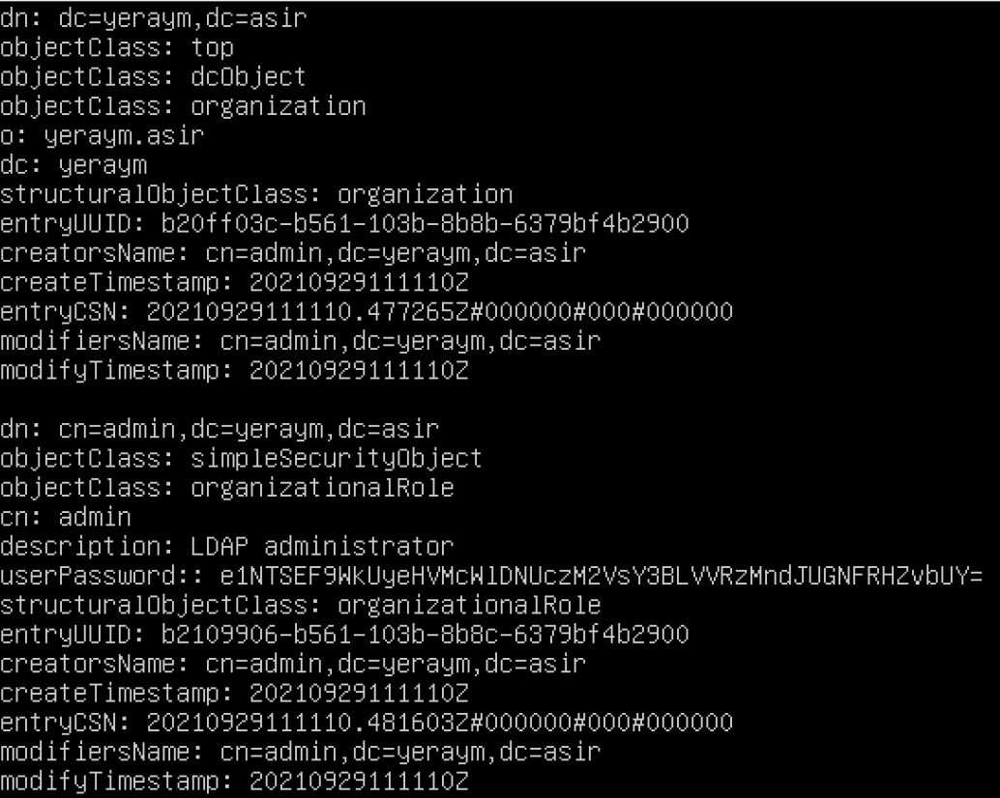


El siguiente paso consistirá en comenzar a incluir contenido. Como cabe esperar, lo primero que debemos hacer es configurar la estructura básica del directorio. Es decir, debemos crear la estructura jerárquica del árbol (DIT – Directory Information Tree). Para este caso es yeraym.asir

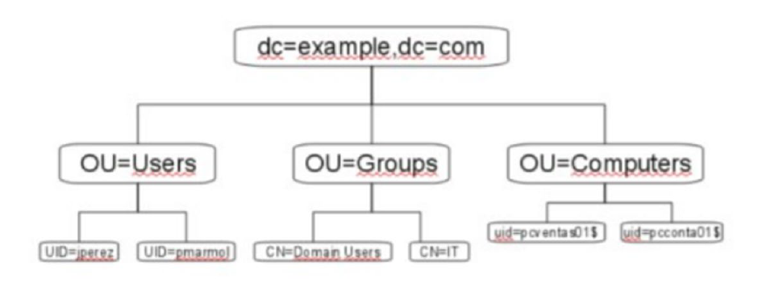

A continuación, se muestra un archivo LDIF que define la estructura de dos unidades organizativas (OU). Este archivo se utilizará con el comando ldapadd para añadir dichas unidades organizativas a la estructura del dominio dentro del directorio LDAP.

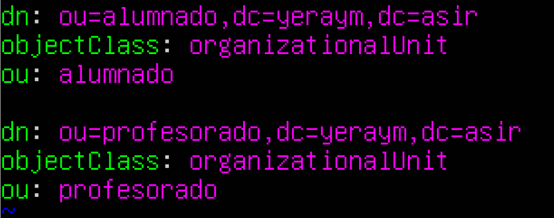

A continuación, añadir la información a la base de datos OpenLDAP. Esto se hace con el comando ldapadd:

- ☐ -x autenticación simple sin SASL (Simple Authentication and Security Layer).
- ☐ -D nombre distinguido con el que nos conectamos a LDAP (ponemos el del administrador).
- ☐ -W pide la contraseña de forma interactiva.
- ☐ -f fichero a cargar. En este caso: estructura base.ldif

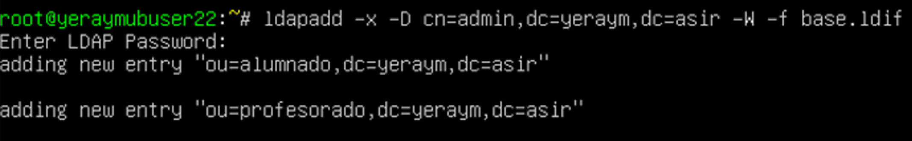

A continuación, añadimos algunos usuarios más:

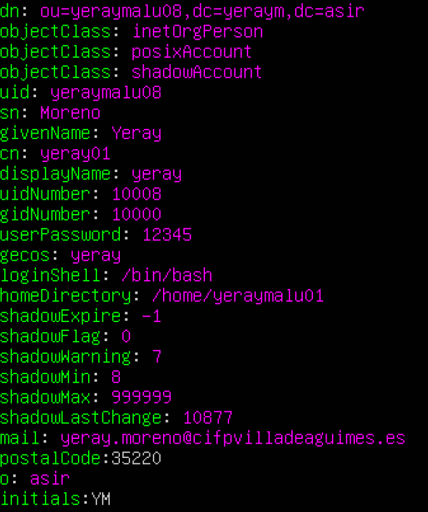 &emsp;&emsp;&emsp;&emsp;&emsp;&emsp;&emsp;&emsp;&emsp;&emsp;&emsp;&emsp; 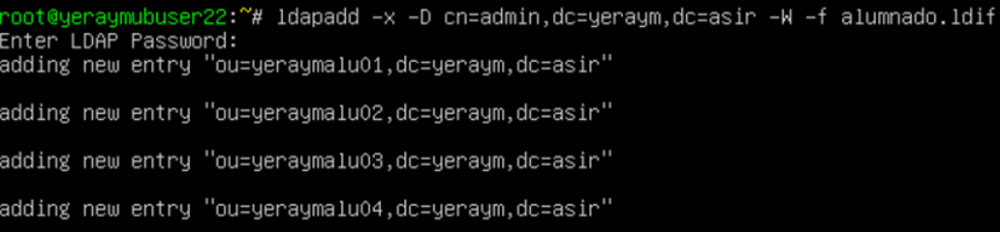


## Comprobaciones:

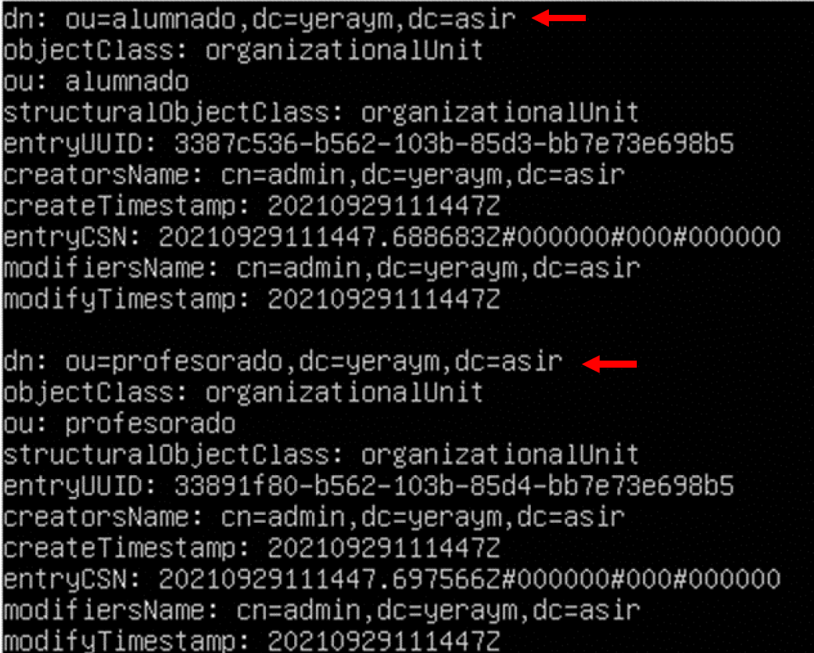
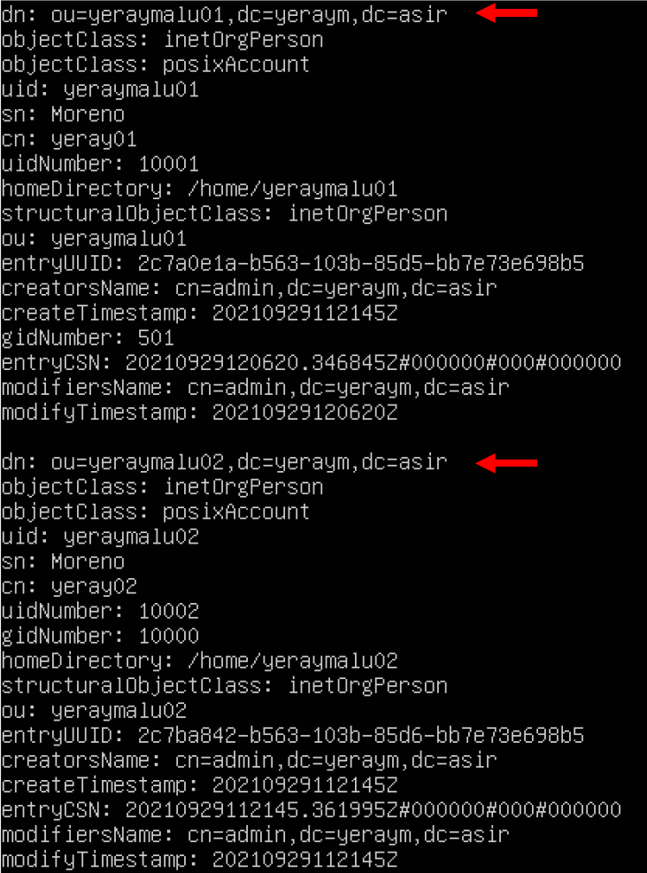

ldapmodify: permite añadir entradas o realizar modificaciones. Posibilita modificar entradas de un directorio LDAP aceptando la introducción de datos a través de un fichero o de la línea de comandos si no se especifica.

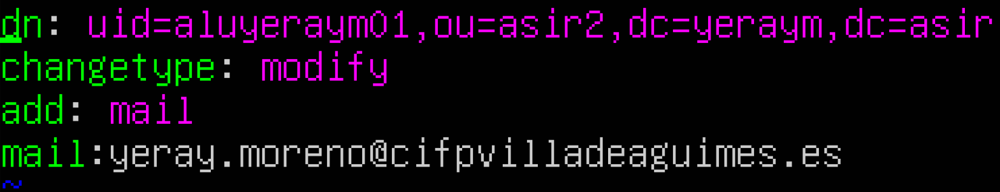

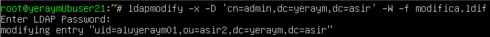

ldapsearch: realiza consultas. Por ejemplo, a continuación, se muestran los nombres comunes y los correos de todos los usuarios del dominio:

- `-L` → salida en formato LDIF / `-LL` → elimina comentarios / `-LLL` → elimina también las líneas en blanco
- `-b` → define desde dónde buscar (Base DN)

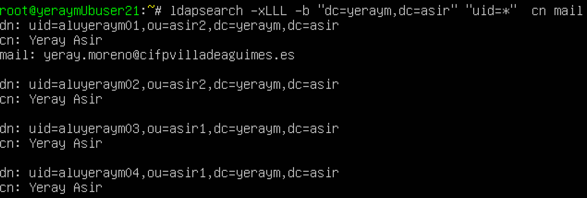

ldapdelete: permite borrar entradas del directorio mediante un fichero o desde línea de comando.

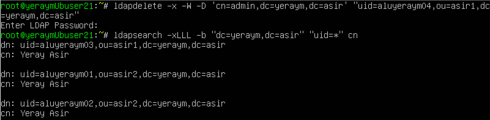

Para gestionar LDAP mediante una interfaz gráfica, puedes considerar varias opciones de software que facilitan la administración de manera visual:

- Apache Directory Studio: Herramienta de administración LDAP ampliamente utilizada que proporciona una interfaz gráfica intuitiva para administrar directorios LDAP.
- PHPLDAPAdmin: Herramienta basada en web que te permite administrar directorios LDAP a través de una interfaz web.
- JXplorer: Herramienta Java gratuita y de código abierto que proporciona una interfaz gráfica para la administración de directorios LDAP.
- LDAP Account Manager (LAM): Herramienta que ofrece una interfaz web para administrar cuentas y grupos en un directorio LDAP.

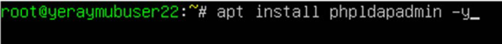

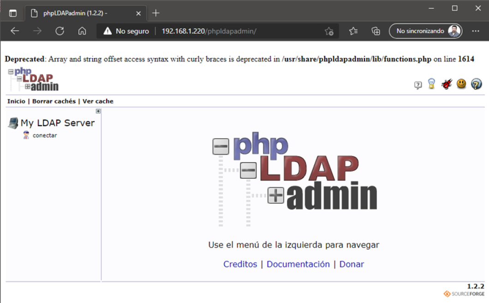

Antes de establecer conexión con el dominio se debe configurar el phpldapadmin. El archivo /etc/phpldapadmin/config.php es el archivo de configuración de phpldapadmin. El método setValue te permite configurar diversas opciones que afectan la forma en que se interactúa con tu servidor LDAP. Algunas opciones que puedes configurar utilizando setValue:

☐ server

- 'name': Nombre del servidor.
- 'host': Dirección IP o nombre del servidor LDAP.
- 'port': Puerto del servidor LDAP.
- 'base': Base DN para búsquedas y operaciones.
- 'tls': Habilitar o deshabilitar TLS/SSL.

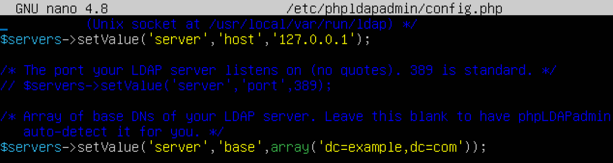


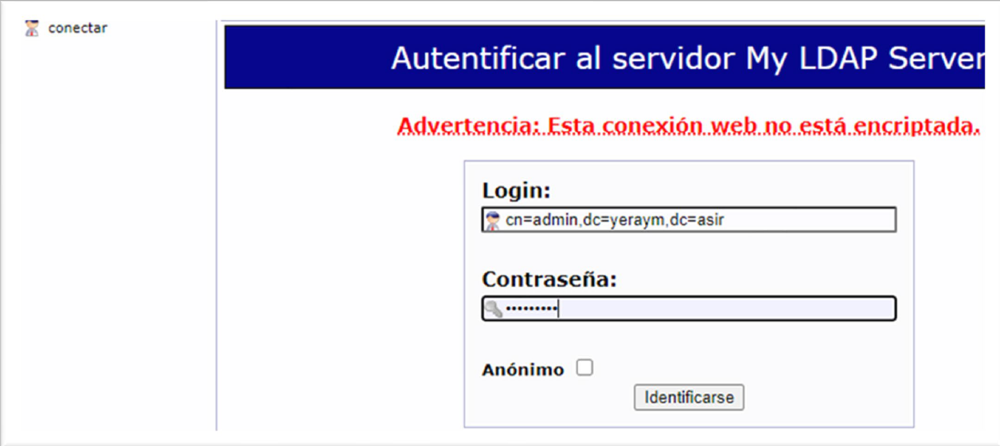
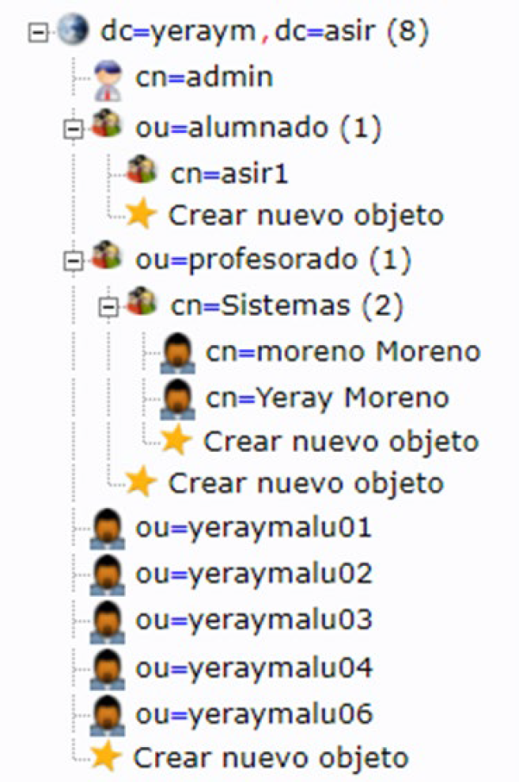

# AÑADIR CLIENTE EN OPENLDAP

En Ubuntu, necesitaremos ajustar el comportamiento de los servicios NSS y PAM en cada cliente que debamos configurar. Comenzamos por instalar los siguientes paquetes:

☐ libnss-ldap: Permitirá que NSS obtenga de LDAP información administrativa de los usuarios (Información de las cuentas, de los grupos, información de la máquina, los alias, etc.)
☐ libpam-ldap: Que facilitará la autenticación con LDAP a los usuarios que utilicen PAM.
☐ ldap-utils: Facilita la interacción de LDAP desde cualquier máquina de la red.

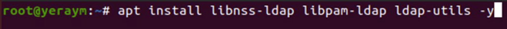

En el primer paso, nos solicita la dirección URi del servidor LDAP. En nuestro caso, escribiremos la dirección IP del servidor y sustituiremos el protocolo ldapi:// por ldap://

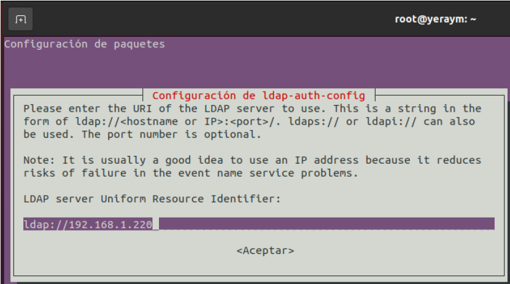

En el siguiente paso, debemos indicar el nombre global único (Distinguished Name – DN).

Inicialmente aparece en valor dc=example,dc=net pero nosotros lo sustituiremos por dc=nombre,dc=sistemas.

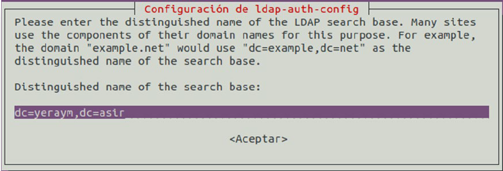


El asistente nos pide el número de versión del protocolo LDAP que estamos utilizando. De forma predeterminada aparece seleccionada la versión 3.

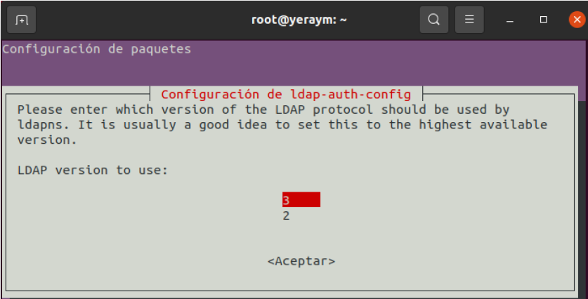

Indicaremos si las utilidades que utilicen PAM deberán comportarse del mismo modo que cuando cambiamos contraseñas locales. Esto hará que las contraseñas se guarden en un archivo independiente que sólo podrá ser leído por el superusuario.

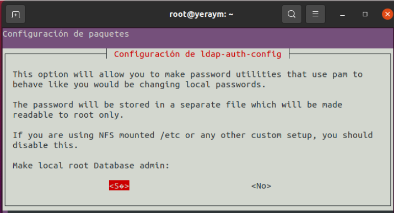

Después, el sistema nos pregunta si queremos que sea necesario identificarse para realizar consultas en la base de datos de LDAP.

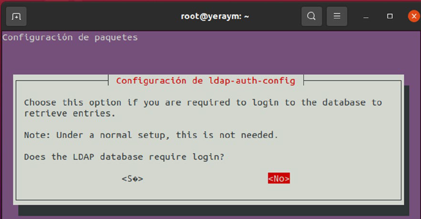

Nombre de la cuenta LDAP que tendrá privilegios para realizar cambios en las contraseñas.

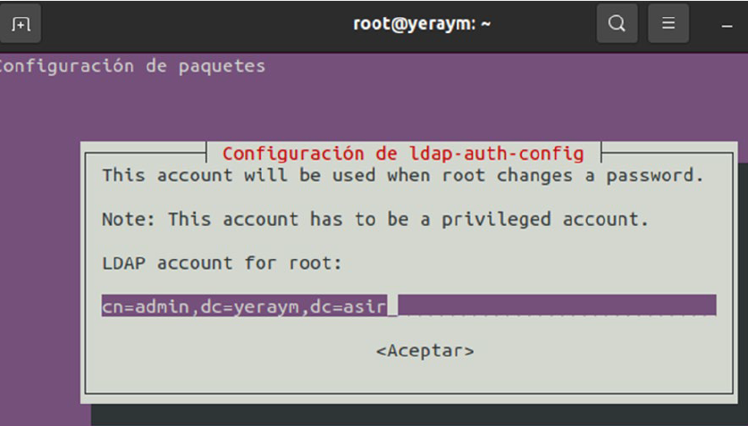

La contraseña que usará la cuenta (como siempre, habrá que escribirla por duplicado para evitar errores tipográficos). Deberá coincidir con la que escribimos en el apartado Instalar OpenLDAP en el servidor.

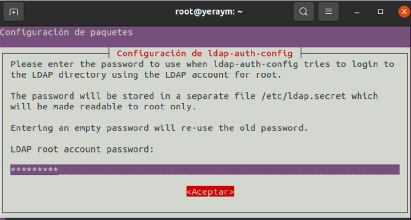

Para completar la tarea, deberemos cambiar algunos parámetros en los archivos de configuración del cliente. En concreto, deberemos editar:

- /etc/nsswitch.conf
- /etc/pam.d/common-password
- /etc/pam.d/common-session.

/etc/nsswitch.conf

Se incluyen las fuentes desde las que se obtiene la información del servicio de nombres en diferentes categorías y en qué orden. Cada categoría de información se identifica bajo un nombre.

☐ Localizamos las líneas que comienzan por passwd, group y shadow y les añadimos el texto ldap, para indicar el nuevo origen para autenticar las cuentas.

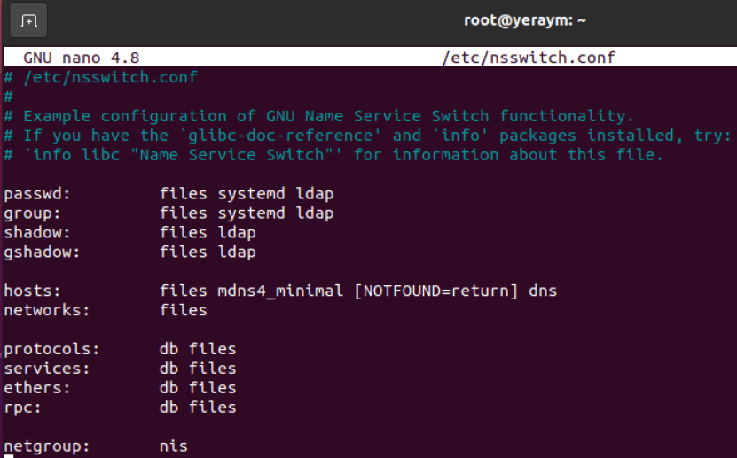

/etc/pam.d/common-password

Proporciona un conjunto común de reglas PAM para la comprobación de contraseñas. En particular, la opción use_authtok, que impide utilizar un segundo método de autenticación cuando ya ha sido aplicado otro anterior, aunque éste haya sido insatisfactorio.

☐ Deberemos eliminar la opción use_authtok

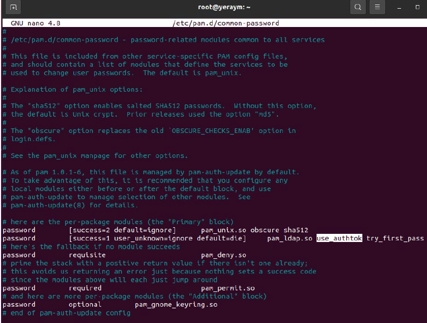


**/etc/pam.d/common-sesión**

Ofrece un conjunto de reglas PAM para el inicio de sesión, tanto si éste es interactivo como si es no interactivo. Aquí será donde indiquemos que se debe crear un directorio home durante el primer inicio de sesión, también para los usuarios autenticados mediante LDAP.

☐ Este comportamiento lo conseguiremos añadiendo al final del archivo la siguiente línea:

session optional &emsp;&emsp;&emsp;&emsp;&emsp;&emsp;&emsp;&emsp;&emsp;&emsp;&emsp;&emsp; pam_mkhomedir.so skel=/etc/skel umask=077

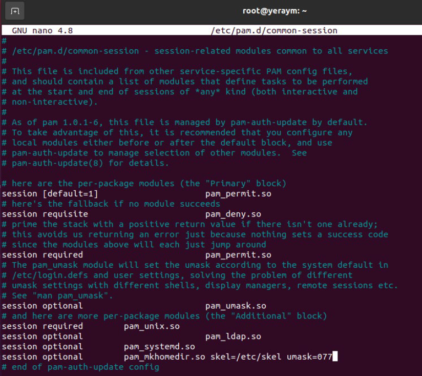

Una vez terminada la instalación, ya podemos activar el servicio libnss-ldap.

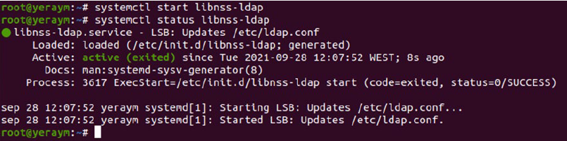

La forma más sencilla de comprobar que podemos iniciar sesión en el servidor usando LDAP consiste en arrancar el sistema en modo texto (o arrancarlo en modo gráfico y usar la combinación de teclas alt + ctrl + f1 para ir a una consola de texto) y escribir las credenciales de un usuario LDAP.

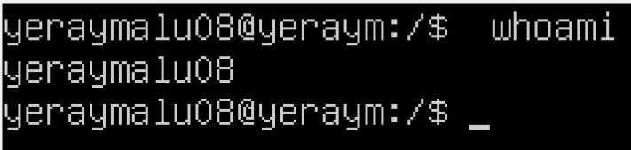

La mayoría de las veces necesitarás que los clientes puedan iniciar sesión en la interfaz gráfica. El problema es que el gestor de sesiones que utiliza Ubuntu es LightDM. Este es quien se encarga de presentarnos la pantalla de autenticación y, en el caso de LightDM, sólo incluye en la lista aquellos usuarios que ya conoce.

Si necesitas que muchos usuarios puedan iniciar sesión en un determinado cliente, quizás la solución más sencilla consista en obligar a LightDM a preguntar por el nombre de la cuenta, antes de pedir la contraseña. Para hacer esto, debemos editar el archivo /usr/share/lightdm/lightdm.conf.d/50-ubuntu.conf

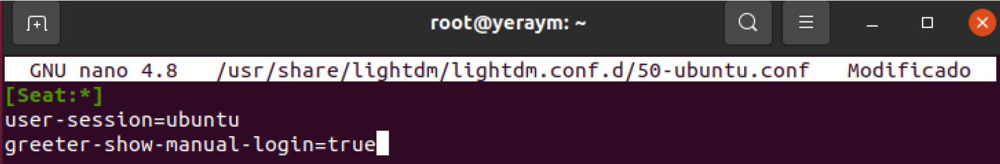

# DOMINIOS SAMBA

Un dominio Samba permite a un servidor Linux actuar como elemento central de autenticación y gestión de recursos en una red, ofreciendo compatibilidad con entornos Windows. Samba implementa los protocolos necesarios para que equipos Windows y Linux puedan compartir usuarios, grupos, archivos y otros servicios de forma integrada. En este contexto, Samba no se limita a la compartición de recursos, sino que puede asumir el rol de controlador de dominio, gestionando identidades y accesos de manera centralizada.

A partir de Samba 4, el servicio incorpora una implementación completa de Active Directory, integrando servicios como LDAP, Kerberos y DNS dentro de una misma infraestructura. Esto permite definir un dominio en el que los usuarios y equipos se autentican contra un único punto, utilizando credenciales comunes independientemente del sistema operativo.

El uso de dominios Samba es habitual en entornos corporativos donde se requiere compatibilidad con clientes Windows sin depender exclusivamente de servidores Windows. Samba permite desplegar dominios funcionales sobre Linux, manteniendo control centralizado sobre usuarios y recursos, y ofreciendo una solución flexible, escalable y alineada con estándares ampliamente utilizados en redes empresariales.

Procedimiento para implementar un Controlador de dominio en Ubuntu, donde los equipos clientes con Windows puedan iniciar sesión y utilizar sus recursos sin notar la diferencia con un servidor Windows Server. Antes de comenzar tendremos en cuenta las siguientes configuraciones bases y prepararemos el servidor para seguir con la instalación de paquetes

☐ Nombre del controlador de dominio de Active Directory: nombre-dc-smb
☐ Nombre DNS del dominio de Active Directory: nombre.sistemas
☐ Nombre del Reino Kerberos: nombre.sistemas
☐ Nombre NetBIOS del dominio: nombre
☐ Dirección IP fija del servidor: 172.16.31.200
☐ Rol del servidor: Domain Controller (DC)
☐ Reenviador DNS:172.16.31.1


Actualizar el sistema

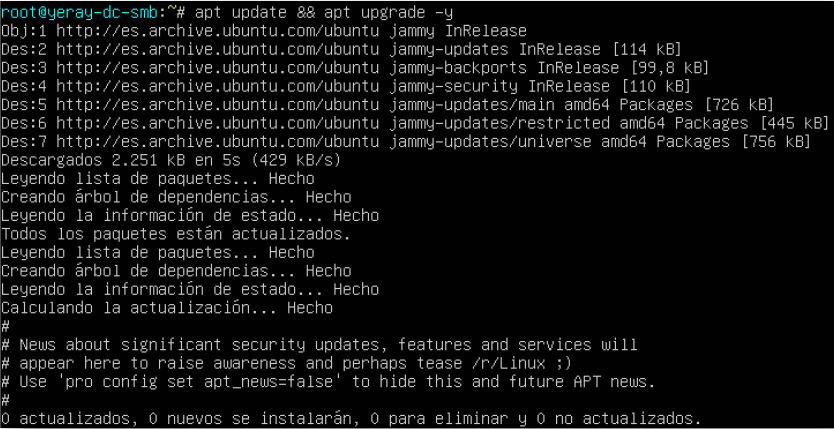


Establecer un nombre adecuado para el servidor:
**nombre-dc-smb**

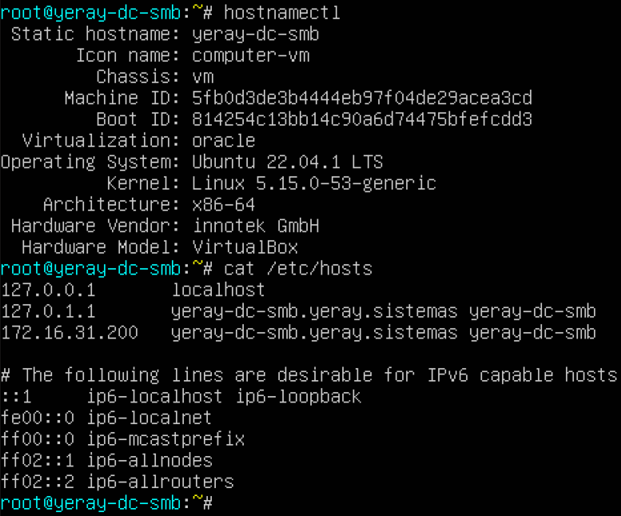


Lo siguiente será configurar las características de red según las necesidades del servidor. Recuerda que un servidor debe tener IP fija.

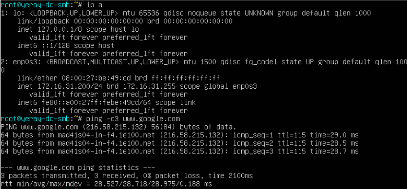

Necesitaremos disponer de los siguientes paquetes preinstalados antes de comenzar con el proceso de configuración, aunque todos ellos están en los repositorios:

☐ samba: servidor de archivos, impresión y autenticación para SMB/CIFS.
☐ smbclient: clientes de línea de comandos para SMB/CIFS.
☐ krb5-config: Archivos de configuración para Kerberos Version 5.
☐ winbind: Servicio para resolver información sobre usuarios y grupos de servidores Windows NT.

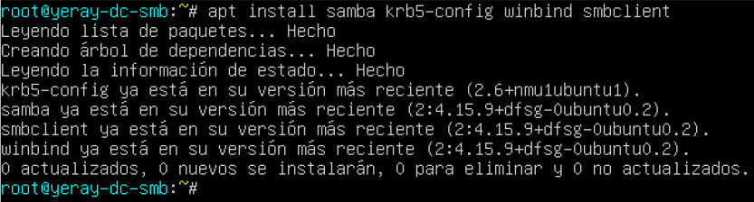

☐ En la instalación de Kerberos, nos preguntará por el reino (realm), se refiere al nombre del dominio:

☐ Después nos solicita el nombre de los servidores de Kerberos para nuestro reino. En este caso, se refiere a los controladores de dominio que tengamos definidos. En nuestro ejemplo sólo tenemos uno:

☐ Por último, nos solicita el servidor administrativo para nuestro reino de Kerberos, como sólo tenemos uno:

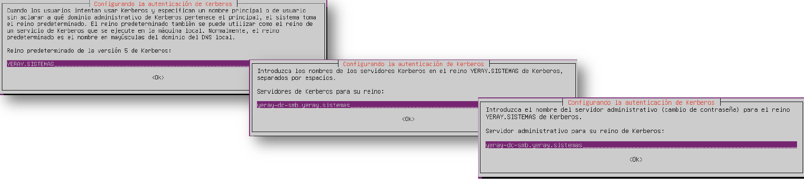

Debemos cambiar de nombre el archivo smb.conf que contiene la configuración predeterminada, para evitar que Samba intente usarlo durante el proceso de configuración y estar seguros de que todos los datos del nuevo archivo de configuración se producen desde cero. Además, también podremos recuperarlo en caso de que algo salga mal.

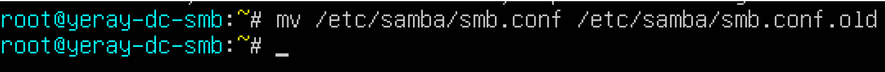

Ahora ya estamos listos para promover nuestro equipo como controlador de un dominio Samba 4 que actúe como un reemplazo completo de un servidor de dominio de Active Directory.

Para promover nuestro equipo como controlador de un dominio lograrlo, usaremos el comando **samba-tool domain provision**, y lo haremos de forma interactiva, para que sea el propio comando el que nos sugiera sus valores predeterminados. Así, si éstos coinciden con los que nosotros esperamos, será muy probable que los pasos anteriores hayan sido los correctos.

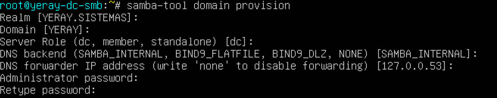

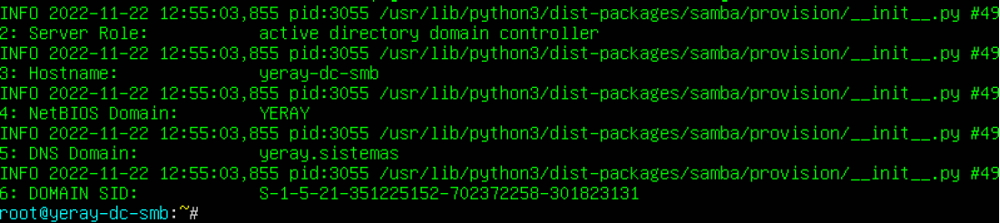

# CONFIGURAR SAMBA

Con el anterior comando se generó el archivo de configuración de Kerberos en la ruta /var/lib/samba/private/krb5.conf. Solo tenemos que copiarlo a la ubicación adecuada.

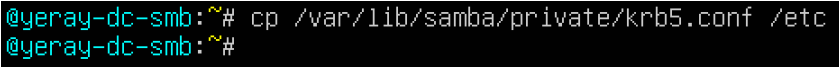

Seguimos ajustando la resolución de nombres, y comenzaremos deteniendo los servicios implicados y deshabilitándolos para que no vuelvan a iniciarse si reiniciamos el equipo.

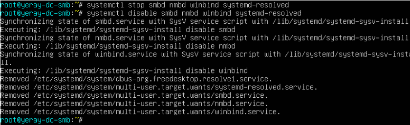


Aseguramos de que el servicio **samba-ad-dc** se podrá iniciar sin dificultades, evitando cualquier enmascaramiento que pueda existir y eliminamos el archivo **resolv.conf** que, en realidad, será un enlace a `../run/systemd/resolve/stub-resolv.conf` y generamos uno nuevo con escribiremos los valores adecuados para nuestro dominio y por último activamos el servicio:

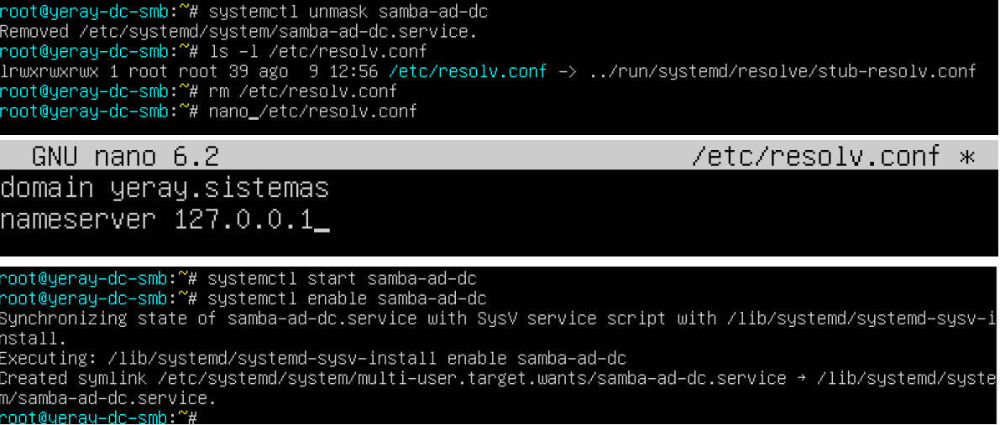

Una vez finalizada la instalación vamos a proceder a la comprobación del dominio de Samba realizando las siguientes tareas:

1. Consultar el nivel del dominio y crear un nuevo usuario.
2. Confirmar que el servidor DNS funciona de forma adecuada
3. Comprobar el funcionamiento de Kerberos
4. Comprobación de inicio de sesión en el servidor y su integridad
5. Añadir un equipo con Windows al dominio y comprobar en servidor.

# COMPROBAR DOMINIO SAMBA

☐ El comando samba-tool domain level show te permite verificar el nivel funcional del dominio en tu controlador de dominio Samba. En este caso equivale a una instalación Windows Server 2008 R2.

☐ A continuación, crearemos un nuevo usuario en el dominio llamado nombre01.

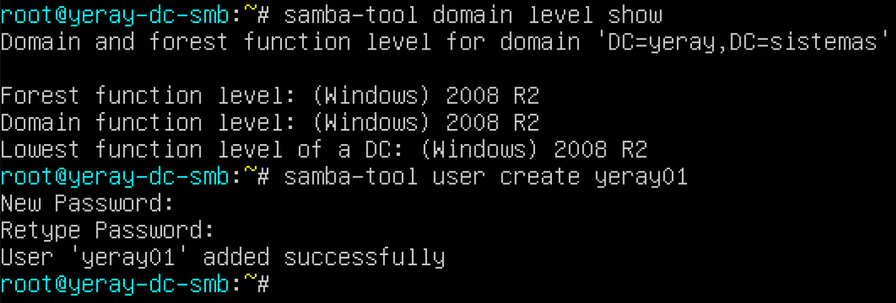

Comprobaciones del servidor DNS interno del propio Samba, mas concretamente de los registros SRV encargados de almacenar, dentro de la base de datos DNS, la relación entre el nombre de un servicio y el nombre DNS del ordenador que ofrece dicho servicio.

☐ Comprobar el servicio LDAP sobre el protocolo TCP.
☐ Comprobar el registro SRV para el protocolo Kerberos sobre UDP.
☐ Comprobar la resolución del nombre de nuestro servidor.

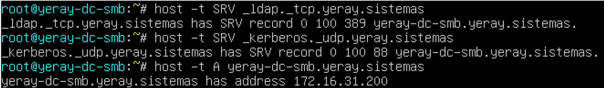

Ahora nos aseguramos de que se resuelven correctamente los nombres y las IPs del dominio. Al ejecutar nslookup sin argumentos, aparece un signo ‘mayor que’ a modo de prompt, donde podemos ir escribiendo argumentos.

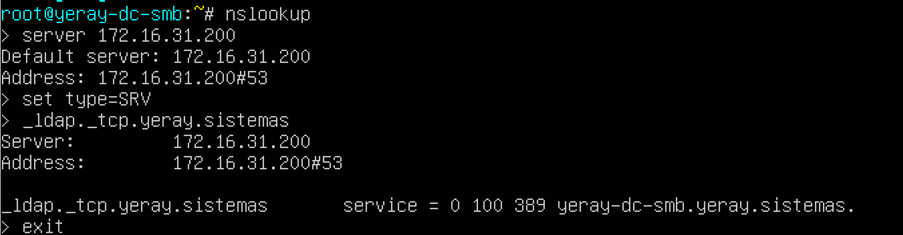

Para comprobar el funcionamiento de Kerberos podemos usar el comando smbclient para comprobar los servicios que puede obtener un determinado usuario.

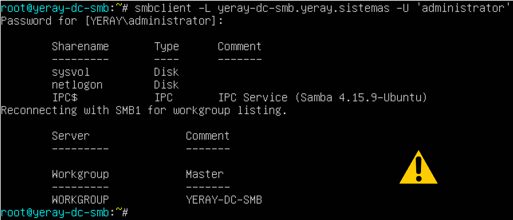

Comprobar el inicio de sesión en el servidor verificando la integridad del archivo de configuración de Samba con el comando testparm

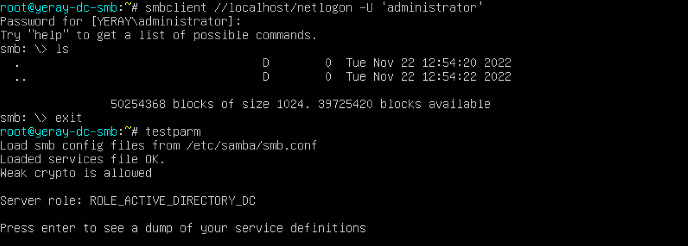

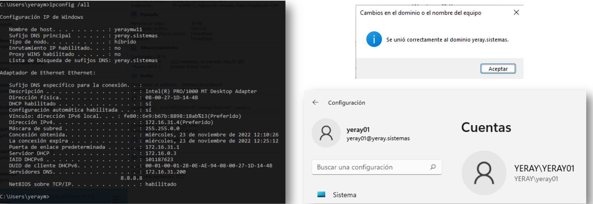


